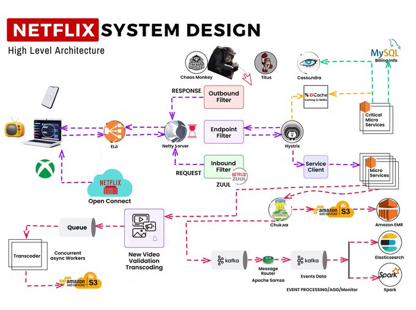

We see three critical differences between programming and software engineering: time, scale, and the trade-offs at play. On a software engineering project,
engineers need to be more concerned with the passage of time and the eventual need for change. In a software engineering organization, we need to be more concerned
about scale and efficiency, both for the software we produce as well as for the organization that is producing it. Finally, as software engineers, we are asked to
make more complex decisions with higher-stakes outcomes, often based on imprecise estimates of time and growth.

Engenharia de software não é apenas programar, por mais que seja a principal habilidade necessária, mas se baseia também na organização do tempo, alterações que são necessárias
com o decorrimento do projeto e features que acabam tendo que ser "sacrificadas" pelo bem de outras com mais valor, o chamado "trade-off".

Within Google, we sometimes say, “Software engineering is programming integrated over time.” Programming is certainly a significant part of software engineering: after all,
programming is how you generate new software in the first place. If you accept this distinction, it also becomes clear that we might need to delineate between programming tasks
(development) and software engineering tasks (development, modification, maintenance). The addition of time adds an important new dimension to programming. Cubes aren’t squares,
distance isn’t velocity. Software engineering isn’t programming.

Novamente é mostrado que engenharia de software não é apenas programar pois a adição do fator "tempo" na equação faz com que sejam necessárias várias outras habilidades.
Programação de software se baseia apenas no desenvolvimento, mas a engenharia de software amplia isso para fatores como modificações e manutenção.

Windows                Linux
Maior acessibilidade   Gratuito e Open Source
Intuitivo              Mais configurável
Facilidade             Mais leve

Um exemplo de trade-off em uma aplicação real é o aumento da complexidade que acaba fazendo com que haja uma diminuição de performance em troca da alta escalabilidade 
no desenvolvimento do Netflix para que milhões de deispositivos em todo o mundo consigam utilizar o serviço simultaneamente e em diferentes tipos de dispositivos.
Vemos pela imagem a grande quantidade de sistemas e microserviços que ocorrem ao mesmo tempo. A aplicação ficou desse jeito por causa da enorme demanda e a necessidade
por maios escalabilidade, pois no começo, o formato da arquitetura da Netflix era em "monolito", porém, com tantas requisições, tiveram que abrir mão da simplicidade 
desse tipo de arquitetura e começaram a utilizar a arquitetura de micro-serviços.

 

Filme
public class Filme {

    private int anoLancamento;
    private int duracao;

    public Filme(int notaCritica, int anoLancamento) {
        this.duracao = notaCritica;
        this.anoLancamento = anoLancamento;
    }

    public int getDuracao() {
        return duracao;
    }

    public void setDuracao(int duracao) {
        this.duracao = duracao;
    }

    public int getAnoLancamento() {
        return anoLancamento;
    }

    public void setAnoLancamento(int anoLancamento) {
        this.anoLancamento = anoLancamento;
    }
}

Assistidos
import java.util.ArrayList;
import java.util.List;

public class ColecaoDeFilmes {
    private List<Filme> filmesAssistidos;
    
    public ColecaoDeFilmes() {
        this.filmesAssistidos = new ArrayList<>();
    }

    public void adicionarFilme(Filme filme) {
        filmesAssistidos.add(filme);
    }

    public List<Filme> listarFilmes() {
        return new ArrayList<>(filmesAssistidos);
    }

    public List<Filme> buscarFilmesPorAno(int ano) {
        List<Filme> encontrados = new ArrayList<>();
        for (Filme filme : filmesAssistidos) {
            if (filme.getAnoLancamento() == ano) {
                encontrados.add(filme);
            }
        }
        return encontrados;
    }

    public List<Filme> buscarFilmesPorDuracao(int duracao) {
        List<Filme> encontrados = new ArrayList<>();
        for (Filme filme : filmesAssistidos) {
            if (filme.getDuracao() == duracao) {
                encontrados.add(filme);
            }
        }
        return encontrados;
    }
}
